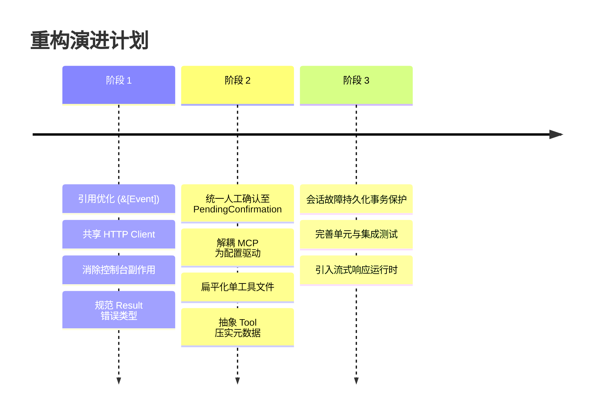

# Rust AI Agent 架构评估与重构路线图 (Codebase Review & Refactoring Roadmap)

> **项目定位**：配套 Bilibili 教程系列《用 Rust 构建 AI Agent》（软件工艺师），基于 Rust 2024 Edition 构建的教学与探索型 AI Agent 框架。

---

## 1. 总体评估与现状总结

### 1.1 现状与亮点
- **编译与规范**：在 Rust 2024 edition 下无警告编译，`cargo clippy` 零报错，基础类型设计严谨。
- **完整 Agent 闭环**：实现了 ReAct 循环、多轮会话持久化（`SessionManager`）、MCP 协议集成、结构化输出（`run_structured<T>`）以及 GAIA Benchmark 自动化评测。
- **上下文工程完备**：集成了基于 Token 计数的滑动窗口（Sliding Window）、增量摘要（Summarization）和历史工具调用压实（Compaction）。

### 1.2 核心痛点与重构动机
当前代码库由教程逐集演进形成（ep04 → ep10），带有明显的“演进补丁”痕迹：
1. **架构冲突**：存在两套完全独立且冲突的人工介入（Human-in-the-loop）机制；
2. **硬编码耦合**：MCP 客户端直接绑定本地子进程，上下文压实直接硬编码具体工具名；
3. **性能与惯用手法瑕疵**：高频全量深拷贝会话事件列表，底层 HTTP 连接池未复用；
4. **过度碎片化**：单工具拆分为 3 个小文件（20+ 文件处理简单工具），维护路径长。

---

## 2. 深度技术审查与代码异味 (Code Smells)

### 2.1 架构层痛点

#### A. 冲突的人工确认机制
- **机制 1 - 阻塞式拦截器** (`ApprovalCallback`)：
  在 `before_tool_callback` 中通过 `tokio::task::spawn_blocking` 直接从标准输入读取 `y/n`，拦截成功后返回伪造结果。
- **机制 2 - 状态机挂起/恢复** (`AgentStatus::PendingConfirmation`)：
  在 `runtime.rs` 中检测 `Tool::requires_confirmation()`，生成 `PendingToolCall` 并暂停 Agent 循环，等待调用方提供 `ToolConfirmation` 后恢复。
- **冲突现状**：在 `main.rs` 中注册了 `ApprovalCallback`，而 `DeleteFileTool` 根本未实现 `requires_confirmation()`，导致更具扩展性的状态机机制被架空。

#### B. MCP 客户端缺乏通用抽象
- `src/tools/mcp/client.rs` 中硬编码了启动命令：
  ```rust
  Command::new("cargo").configure(|cmd| {
      cmd.args(["run", "--quiet", "--bin", "expense_mcp_server"]);
  })
  ```
- `src/tools.rs` 中无条件启动该进程。若环境中缺少 cargo 或该二进制不存在，工具箱直接初始化失败。

#### C. 上下文压实（Compaction）违反开闭原则
- `src/callback/context_optimizer/compaction.rs` 中直接硬编码了匹配 `"read_file"` 与 `"web_search"`：
  ```rust
  let replacement = match name.as_str() {
      "read_file" => { ... }
      "web_search" => { ... }
      _ => None,
  };
  ```
  通用上下文优化器反向依赖具体工具，新增工具必须修改优化器源码。

---

### 2.2 Rust 惯用法与性能问题

#### A. `ExecutionContext::events()` 产生无谓深拷贝
在 `src/agent/context.rs`：
```rust
// 现有实现：每次调用都把整条历史深度复制一次
pub fn events(&self) -> Vec<Event> {
    self.session.events.clone()
}
```
每次 LLM 轮次在 `prepare_llm_request`、`print_tool_trace` 以及 `extract_query` 时，都会完整复制所有 `Event`，对多轮对话造成大量堆内存分配。
**改进方案**：
```rust
pub fn events(&self) -> &[Event] {
    &self.session.events
}
```

#### B. `async_openai::Client` 未复用连接池
在 `runtime.rs`、`summarization.rs`、`embed.rs`、`stream.rs` 中，每次调用均新建 `Client::new()`。
`Client` 内部包装了 `reqwest::Client`，新建实例无法共享 HTTP Keep-Alive 连接池，显著增加网络握手开销。
**改进方案**：让 `Agent` 持有 `Arc<async_openai::Client>` 并将其按需注入给各模块。

#### C. 基础库污染标准输出
`src/llm/stream.rs` 在底层工具函数中直接包含了 `print!("{txt}")`：
```rust
while let Some(result) = s.next().await {
    match result {
        Ok(txt) => {
            output.push_str(&txt);
            print!("{txt}"); // 库函数副作用：强制输出到控制台
        }
        ...
```
这导致上层若希望作为纯 API 或静默服务调用时无法捕获或重定向流式输出。

#### D. 类型别名与引入异味
- 在多个文件中使用了 `use anyhow::Ok;`（如 `manager.rs`, `embed.rs`, `search.rs`），覆盖了原生的 `std::result::Result::Ok`。
- `src/tools/calculator/execute.rs` 中声明为 `anyhow::Result<f64, String>`，偏离了 `anyhow` 单参数惯用法。

---

### 2.3 文件与目录碎片化
每个内置工具均拆分为 3 个文件：
```text
src/tools/
├── calculator.rs          (pub mod execute; pub mod r#impl;)
└── calculator/
    ├── execute.rs         (计算函数与入参定义)
    └── impl.rs            (Tool trait 实现)
```
一个 30 行的工具被分散在 3 个文件内，降低了代码可读性与导航效率。

---

## 3. 分阶段重构方案 (Refactoring Roadmap)



---

### 阶段 1：低风险清理与性能调优（保持对外 API 稳定）

1. **零成本消除深拷贝**
   - 修改 `ExecutionContext::events(&self) -> &[Event]`。
   - 适配 `prepare_llm_request`、`print_tool_trace` 等调用处直接使用引用迭代。

2. **连接池复用**
   - 在 `Agent` 结构体中添加 `client: Arc<async_openai::Client>` 字段并在初始化时注入。
   - `knowledge_base::embed` 与 `context_optimizer::summarization` 接收 client 引用。

3. **去除底层 `print!` 副作用**
   - 改造 `chat_stream_with_retry`，通过回调函数或纯异步 `Stream` 暴露 token，由终端主程序负责打印。

4. **规范类型与引入**
   - 移除所有 `use anyhow::Ok;`。
   - 规范 `calculator` 返回值为标准 `Result<f64, String>`。

---

### 阶段 2：架构治理与解耦

1. **统一人工审批流程**
   - 彻底废弃 `ApprovalCallback`。
   - 在 `DeleteFileTool` 等敏感工具中显式实现：
     ```rust
     fn requires_confirmation(&self) -> bool { true }
     fn confirmation_message_template(&self) -> &str {
         "即将执行高危文件删除操作：{arguments}，是否批准？"
     }
     ```
   - `main.rs` 统一监听 `AgentStatus::PendingConfirmation` 进行交互确认与 `agent.run(..., Some(confirmations))` 恢复。

2. **解耦 MCP 架构**
   - 将 `McpClient` 泛化为接收配置对象：
     ```rust
     pub struct McpServerConfig {
         pub name: String,
         pub command: String,
         pub args: Vec<String>,
         pub env: HashMap<String, String>,
     }
     ```
   - 支持通过配置文件或动态参数挂载任意外部标准 MCP 服务。

3. **收敛单工具文件组织**
   - 将 `tools/<name>/execute.rs` 与 `tools/<name>/impl.rs` 合并为 `tools/<name>.rs`。
   - `tools/` 根目录下仅保留各工具独立的单文件与公共 trait。

4. **上下文压实可扩展性**
   - 在 `Tool` trait 中引入可选方法：
     ```rust
     fn compact_result(&self, args: &Value, content: &str) -> Option<String> {
         None
     }
     ```
   - `Compaction` 遍历调用工具本身的压实策略，解除硬编码依赖。

---

### 阶段 3：工程健壮性与生产就绪

1. **可靠的会话状态保存**
   - 当前会话仅在运行成功或进入确认时持久化。若中途发生异常，之前的上下文事件丢失。应在每轮 Step 或关键事件插入后同步/异步持久化。
2. **测试金字塔补齐**
   - 针对 `Agent` 的状态转移（`Complete`、`PendingConfirmation`、`MaxStepsExceeded`）编写基于 Mock LLM 的单元测试。
   - 针对滑动窗口安全截断点（`find_safe_start`）编写边缘用例测试。
3. **支持流式 Agent 输出**
   - 丰富 `Agent::run_stream`，使得多轮工具调用的思考与最终回答能够边推理边输出到前端或终端。

---

## 4. 行动项对照清单 (Checklist)

| 模块 | 改进项 | 优先级 | 影响范围 |
| :--- | :--- | :--- | :--- |
| **`agent::context`** | 将 `events()` 从返回 `Vec<Event>` 改为返回 `&[Event]` | P0 | 零破坏性，立即降低内存开销 |
| **`agent::confirmation`** | 统一采用 `PendingConfirmation` 状态机，移除阻塞式 `ApprovalCallback` | P0 | 统一架构，解耦控制台交互 |
| **`llm::stream`** | 剥离底层 `print!`，改为纯 Stream 模式 | P1 | 消除库函数副作用 |
| **`tools::mcp`** | 剥离硬编码的 `expense_mcp_server`，提供配置化进程拉起 | P1 | 提升 MCP 生态通用扩展能力 |
| **`tools::*`** | 合并每个工具的 `execute.rs` 与 `impl.rs`，消除多层碎片目录 | P1 | 提升代码整洁度与阅读体验 |
| **`callback::compaction`** | 消除针对 `read_file` 和 `web_search` 的硬编码匹配 | P2 | 恢复开放封闭原则 |
| **`tests`** | 为 Agent 循环、滑动窗口安全点添加单元测试 | P2 | 提升代码健壮性 |
